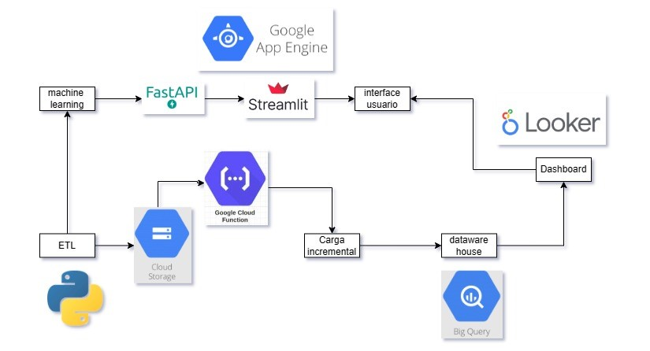
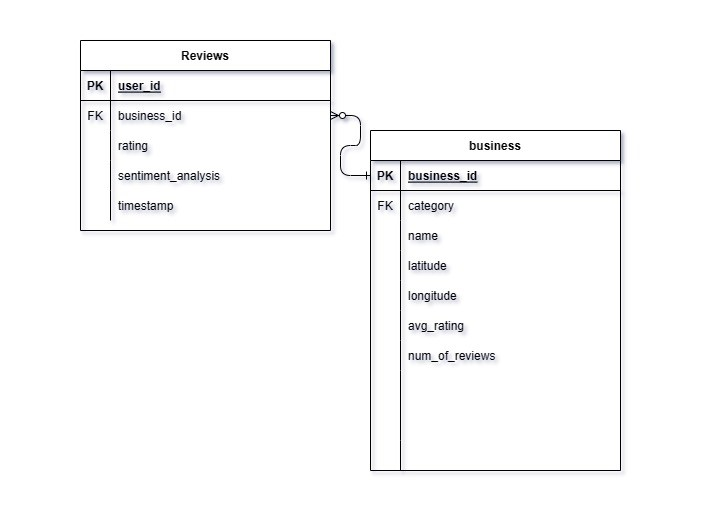
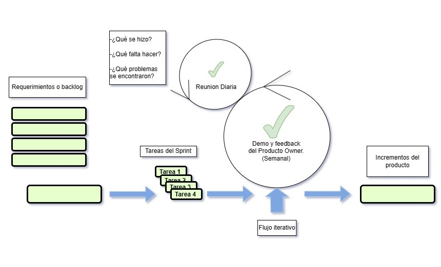

<h1 align="center">🍽️ `YELP & GOOGLE MAPS REVIEWS ` 🗺️</h1>

## 📋 **Tabla de contenidos**
- [Contexto](#Contexto)
- [Objetivos](#Objetivos)
- [MPV](#MVP)
- [Alcance del proyecto](#Alcance-del-proyecto)
- [Limitaciones del proyecto](#Limitaciones-del-proyecto)
- [KPI's](#KPI´s)
- [Metodología de Trabajo](#metodologia-del-trabajo)
- [Stack Tecnológico](#Stack-Tecnológico)

<!-- Contexto section -->
##  **Contexto**

Como parte de una consultora especializada en análisis de datos, hemos sido contratados para llevar a cabo un exhaustivo estudio del mercado estadounidense. Nuestro cliente forma parte de un conglomerado de empresas del sector restaurantero y turístico, y busca obtener un análisis detallado de la opinión de los usuarios en plataformas como Yelp y Google Maps. Este análisis abarcará hoteles, restaurantes y otros negocios relacionados con el turismo y el ocio.

Nuestro enfoque incluirá la aplicación de técnicas avanzadas de análisis de sentimientos para comprender las opiniones de los usuarios y prever las tendencias de crecimiento y declive en diferentes sectores comerciales. Además, se llevará a cabo un estudio de localización estratégica para determinar las zonas más adecuadas para la apertura de nuevos locales de restaurantes y establecimientos relacionados.

Como parte de nuestra solución, desarrollaremos un sistema de recomendación de restaurantes que integrará las preferencias y experiencias previas de los usuarios en ambas plataformas. Este sistema permitirá a los usuarios descubrir nuevos sabores y experiencias gastronómicas basadas en sus preferencias individuales y experiencias anteriores.

<!-- Contexto section -->
##  **Deploy**
[App Data Travel](https://data0science0porject.streamlit.app/)

<!-- objetivos section -->
## **🎯 Objetivos**
### **🌟 Objetivo General 1**

Desarrollar un sistema de recomendación de restaurantes que satisfaga las necesidades y preferencias de los usuarios.

### **🔍 Objetivos específicos**

1. Recomendar restaurantes similares a otros que hayan tenido éxito mediante técnicas de filtrado colaborativo.

2. Sugerir restaurantes que se ajusten a los gustos y preferencias individuales de los usuarios utilizando modelos basados en contenido.

### **🌟 Objetivo General 2**
Identificar la zona más conveniente para la ubicación de nuevos locales mediante el análisis geoespacial y técnicas de correlación, con el fin de tomar decisiones estratégicas que optimicen el rendimiento de un posible nuevo negocio.

### **🔍 Objetivos específicos**
1. Analizar datos de ubicación geográfica y demográficos para identificar variables que puedan correlacionarse con el éxito de un negocio.

2. Evaluar las relaciones de correlación entre estas variables y el rendimiento pasado de negocios similares en diversas áreas geográficas.

3. Seleccionar la zona más prometedora para la expansión del negocio basándose en las correlaciones identificadas.

### **🌟 Objetivo General 3**
Utilizar técnicas de análisis de datos para comprender mejor el comportamiento futuro del mercado en un rubro turístico dado.

### **🔍 Objetivos específicos**
1. Determinar las variables que más influyen en el crecimiento o decrecimiento de los negocios dentro del sector turístico.

2. Identificar tendencias en las ventas o ingresos de diferentes rubros de negocios mediante el análisis de series temporales con modelos ARIMA.

### **🌟 Objetivos Comunes**

1. **Extracción de datos desde la fuente:** Utilizar las API proporcionadas por Yelp y Google Maps, así como la recolección de datos propia y el scrapping para obtener variables demográficas.

2. **Disponibilizar datos en la nube:** Implementar un proceso de carga incremental con servicios de Google Cloud Platform (GCP) para permitir el acceso a los datos desde nuestra plataforma.

3. **Limpieza de Datos:** Corregir valores atípicos, gestionar datos faltantes y normalizar los datos para garantizar su integridad antes del análisis.

4. **Automatización:** Automatizar en la medida de lo posible el proceso de extracción, transformación y carga (ETL) para mejorar la eficiencia y reducir los riesgos de errores manuales.

5. **Documentación:** Detallar exhaustivamente todo el proceso de ETL, incluyendo fuentes de datos, transformaciones realizadas y criterios de calidad aplicados, para facilitar la replicabilidad y el mantenimiento del proceso.

(<a href="#readme-top">volver arriba</a>)

<!-- mpv section -->
## **🚀 MPV**  

El Producto Mínimo Viable (MVP) será una Interfaz de Usuario que incorporará las características delineadas en los objetivos. Esta interfaz estará diseñada con un enfoque en la usabilidad y la accesibilidad, asegurando que los usuarios puedan acceder a las funcionalidades de manera clara y efectiva.
La interfaz de usuario será intuitiva y fácil de usar, permitiendo a los usuarios navegar sin dificultad por las diferentes funciones. Se emplearán elementos visuales y de diseño para mejorar la experiencia del usuario, y se implementará una disposición lógica de las opciones para facilitar la interacción.
Además, la interfaz de usuario será capaz de presentar los resultados de manera visualmente atractiva. Se utilizarán gráficos, mapas y listas de recomendaciones para mostrar la información de manera clara y concisa. Estos elementos visuales proporcionarán una comprensión rápida y fácil de los datos, permitiendo a los usuarios tomar decisiones informadas de manera eficiente.
En resumen, el MVP será una interfaz de usuario intuitiva y visualmente atractiva que proporcionará acceso a las funcionalidades delineadas en los objetivos, permitiendo a los usuarios explorar y utilizar las características de manera efectiva.

<!-- Alcance section -->
## **🌐 Alcance del proyecto**

**Extracción de Datos:** Recopilación y utilización de datos provenientes de plataformas de reseñas como Google Maps y Yelp.

**Análisis de Datos:** Implementación de técnicas avanzadas de Análisis de Datos y Aprendizaje Automático para examinar las reseñas de los usuarios.
El análisis permitirá al sistema identificar tendencias y generar recomendaciones consistentes.

**Cobertura Geográfica:** Enfoque específico en los establecimientos gastronómicos ubicados en los estados de California, Florida y Nueva York en los Estados Unidos.

**Visualización y Sistema de Recomendación:** Desarrollo de una interfaz de usuario intuitiva que permita a los clientes seleccionar sus criterios para la búsqueda de restaurantes.
Presentación visual de los resultados de las recomendaciones.
Integración de un sistema de retroalimentación para que los usuarios puedan proporcionar sus opiniones y sugerencias.

**Iteración y Mejora:** Recopilación de la retroalimentación de los usuarios para realizar iteraciones y mejoras continuas en el sistema.
Adaptación constante del sistema para satisfacer de manera óptima las necesidades y expectativas de los usuarios.Principio del formulario

<!-- Fuera de alcance section -->
## **❌ Limitaciones del proyecto**

**Datos en tiempo real:** Dependemos de las limitaciones impuestas por las API de Google Maps y Yelp, lo que podría dificultar la obtención de datos en tiempo real.
Esta limitación puede afectar la capacidad del sistema para identificar las tendencias más recientes en el mercado.

**Personalización profunda:** Aunque podemos personalizar las recomendaciones basándonos en las reseñas de los usuarios, la personalización profunda, como considerar las preferencias dietéticas individuales o las restricciones alimentarias, podría ser limitada debido a la falta de datos disponibles.

**Escalabilidad:** Aunque el sistema está diseñado para ser escalable y cubrir otras regiones, la implementación inicial se limitará a los estados de California, Florida y Nueva York.
La expansión geográfica podría no ser factible dentro del alcance inicial del proyecto.
Asimismo, extender el modelo a otros sectores comerciales o áreas relacionadas puede estar fuera del alcance inicial del proyecto.

 <!-- KPI section -->
## **📊 KPI´s:**

• **Crecimiento de reseñas positivas:** 
* **Descripción**: Este KPI se enfoca en el aumento porcentual del número de reseñas positivas en comparación con el año anterior.

* **Objetivo**: Incrementar en un 5% las reseñas positivas para los negocios en comparación con el año anterior.

$$
\mathrm{KPI} = \frac{R_{\text{añoActual}}^{+} - R_{\text{añoAnterior}}^{+}}{R_{\text{añoAnterior}}^{+}} \cdot 100
$$

 

• **Disminución de reseñas negativas:** 
* **Descripción**:Este KPI se centra en la disminución porcentual del número de reseñas negativas en comparación con el año anterior.
* **Objetivo**: Reducir en un 5% la tasa de reseñas negativas en comparación con el año anterior.

$$
\mathrm{KPI} = \frac{R_{\text{añoAnterior}}^{-} - R_{\text{añoActual}}^{-}}{R_{\text{añoAnterior}}^{-}} \cdot 100
$$

 

• **Aumento de la tasa anual de retención de usuarios:** 
* **Descripción**:Mide la tasa de usuarios que escriben reseñas año tras año.
* **Objetivo**: Incrementar en un 5% la tasa de reseñas en comparación con el año anterior.

$$
\mathrm{KPI} = \frac{U_{\text{ReseñasActual}}- U_{\text{ReseñasAnterior}}}{U_{\text{ReseñasAnterior}}}
$$

 

<!-- flujo section -->
## **🔧 Flujo de Trabajo**

**Proceso de ETL (Extract, Transform, Load):** 
Al recibir los datos en bruto, se lleva a cabo un trabajo manual y estandarizado de ETL utilizando Python y las librerías pertinentes.
Este proceso incluye la eliminación de columnas irrelevantes, desanidamiento de columnas si es necesario, manejo de valores nulos y duplicados, normalización de tipos de datos y nombres de columnas según un esquema estandarizado.
Posteriormente, se segmentan las tablas según corresponda para su posterior procesamiento.
- **Caminos de Datos:**
- **Camino 1:** Los datos destinados al entrenamiento de los sistemas de recomendación por filtrado colaborativo y basado en contenido se implementan sobre FastAPI, utilizando Streamlit como interfaz y Google App Engine para el despliegue.
- **Camino 2:** Después del proceso inicial de ETL, los datos pasan a un bucket específico en Google Cloud Storage, donde actúan como desencadenante para iniciar las funciones de Google Cloud Functions que ingestarán las tablas en BigQuery.
- **Proceso de Ingesta de Datos en BigQuery:**
Las funciones verifican si los archivos son archivos CSV y, de ser así, los cargan temporalmente.
Luego, se validan si los datos coinciden con el esquema asignado para la tabla de BigQuery y se cargan en una tabla temporal en BigQuery.
Se lleva a cabo un proceso de carga incremental, donde los datos se cargarán en las tablas solo si no están en la tabla original.
- **Condiciones de Merge en BigQuery:**
Para la tabla de reseñas (reviews), se agrega los datos si difieren en user_id y timestamp, asumiendo que el mismo usuario puede haber realizado más de una reseña pero nunca exactamente al mismo tiempo.
Para la tabla de negocios (business), se añaden los datos si business_id es diferente y también si la latitud y longitud son diferentes, asumiendo que puede haber varios locales emplazados en lugares diferentes.
- **Conexión con Looker y Creación de Dashboard Estratégico:**
Una vez cargados en BigQuery, los datos se conectan directamente con Looker para disponibilizarlos de forma integrada.
Se utilizan en la construcción de un dashboard estratégico que luego se embebe en la interfaz de usuario final.
- **Documentación Adicional:**
Junto al código de las funciones en el repositorio, se encuentra un README.md en la subcarpeta ML de la carpeta "Sprint 3 Machine Learning y Analytics", donde se explica con precisión el desarrollo y funcionamiento del modelo de Machine Learning.

## Diagrama E-R

Por lo que respecta al diccionario de datos este se encuentra en el readme.md de la carpeta "Sprint 2 Ingenieria de Datos"

<!-- metodología section -->
## **🔧 Metodología del Trabajo**

Para este proyecto, se implementará la metodología Scrum, la cual divide el trabajo en partes pequeñas y manejables llamadas "sprints". Cada sprint tiene una duración de una semana, durante la cual el equipo se enfocará en completar un conjunto específico de tareas. Al final de cada sprint, se llevará a cabo una reunión de revisión de sprint (sprint review meeting) donde se realizará una demostración de los entregables desarrollados, con el objetivo de recibir retroalimentación y ajustar la planificación para el siguiente sprint según lo aprendido. Además, se llevarán a cabo reuniones diarias de seguimiento (Daily Standup) para discutir el progreso diario y abordar posibles inconvenientes. Este enfoque permite una adaptación continua a medida que el equipo avanza.
Detalles de los Sprints:
**Sprint 1 - Comprensión del Negocio y de los Datos:**
Duración: 1 semana.
Objetivo: Comprender en profundidad el negocio y los datos involucrados en el proyecto.
Actividades:
* Revisión y análisis detallado de los requisitos del cliente.
* Investigación sobre las plataformas de reseñas como Google Maps y Yelp.
* Identificación de posibles fuentes de datos y su relevancia para el proyecto.
Establecimiento de objetivos claros para el proyecto y definición de las métricas de éxito.
**Sprint 2 - Preparación de los Datos y Modelado:**
Duración: 1 semana.
Objetivo: Preparar los datos y realizar el modelado necesario para el desarrollo del sistema de recomendación.
Actividades:
* Extracción de datos de las fuentes identificadas.
* Limpieza y preparación de los datos para su posterior análisis.
* Aplicación de técnicas de modelado de datos para generar insights preliminares.
* Identificación de posibles problemas o desafíos en los datos y su resolución.
**Sprint 3 - Evaluación y Despliegue:**
Duración: 1 semana.
Objetivo: Evaluar el rendimiento del sistema de recomendación y prepararlo para su despliegue.
Actividades:
* Evaluación del modelo de recomendación utilizando métricas relevantes.
* Ajuste y refinamiento del modelo según sea necesario.
* Preparación de la infraestructura necesaria para el despliegue del sistema.
* Despliegue del sistema de recomendación en un entorno de producción.
* Pruebas finales y validación del sistema antes de su lanzamiento oficial.
Siguiendo esta metodología, el equipo podrá avanzar de manera eficiente y adaptarse a medida que avanza el proyecto, asegurando la entrega exitosa de un producto de alta calidad que satisfaga las necesidades del cliente.

<!-- stack section -->
## **💻 Stack Tecnológico**

**Visual Studio Code:** Herramienta de desarrollo utilizada para trabajar de forma local en el proyecto.

- **Bases de datos:** 
* Google Cloud Platform (GCP): Utilizado para almacenar los datos generales del proyecto.
* Google Cloud Function : para la carga incremental
* Big Query : para el dataware house y consultas

- **Lenguajes de programación:** 
* Python: Utilizado tanto para el análisis de datos como para el desarrollo de modelos de machine learning.

- **Bibliotecas y frameworks:** 
* Pandas: Utilizado para manipulación y análisis de datos.
* Scikit-learn, TensorFlow y PyTorch: Frameworks utilizados para el desarrollo de modelos de machine learning.
* FastAPI: Empleado para desarrollar APIs que serán utilizadas en el proyecto.

- **Herramientas de visualización:** 
* Matplotlib, Seaborn y Plotly: Herramientas utilizadas para la visualización de datos, permitiendo crear gráficos y visualizaciones interactivas para el análisis y presentación de resultados.
* Streamlit: para el fronted y la interaccion con el usuario
*   Looker: para el Dashboard

<!-- team section -->
## **👥 Miembros del Equipo**

| Rol            |  Nombre              | LinkedIn | GitHub |
| -------------- |--------------------- | -------- |-|
| Data Engineer  | Sebastian Rosenblunn      | [![LinkedIn][linkedin-shield]][linkedin-Naza]  | [![GitHub][github-shield]][github-Naza]  |
| Data Scientist | Nazareno Fantin | [![LinkedIn][linkedin-shield]][linkedin-Sebas] | [![GitHub][github-shield]][github-Sebas] |
| Data Scientist | Alejo Diez Gomez     | [![LinkedIn][linkedin-shield]][linkedin-Alejo]   | [![GitHub][github-shield]][github-Alejo]   |
| Data Analyst   | Keyla Serna          | [![LinkedIn][linkedin-shield]][linkedin-Keyla] | [![GitHub][github-shield]][github-Keyla] |
| Data Analyst   | Tomás Basovich       | [![LinkedIn][linkedin-shield]][linkedin-Tom] | [![GitHub][github-shield]][github-Tom] |
<!-- | Project Management  | Scrum Master   |  |Maximiliano Vaca Coll |       ||-->

(<a href="#readme-top">volver arriba</a>)

<!-- MARKDOWN LINKS & IMAGES -->
<!-- https://www.markdownguide.org/basic-syntax/#reference-style-links -->

[linkedin-shield]: https://img.shields.io/badge/LinkedIn-0077B5?style=for-the-badge&logo=linkedin&logoColor=white
[github-shield]: https://img.shields.io/badge/GitHub-100000?style=for-the-badge&logo=github&logoColor=white

[linkedin-Naza]: https://www.linkedin.com/in/nazareno-fantin/
[linkedin-Sebas]:https://github.com/Nazario3482/Proyecto-Grupal-Google-yelp  
[linkedin-Alejo]:https://www.linkedin.com/in/alejo-gabriel-diez-gomez-402b93254/
[linkedin-Keyla]:www.linkedin.com/in/keyla-elyneth
[linkedin-Tom]:https://github.com/Nazario3482/Proyecto-Grupal-Google-

[github-Naza]: https://github.com/Nazario3482
[github-Sebas]:https://github.com/Nazario3482/Proyecto-Grupal-Google-yelp
[github-Alejo]:https://github.com/AlejoDiezGomez
[github-Keyla]:https://github.com/KeylaSernaB
[github-Tom]:https://github.com/Nazario3482/Proyecto-Grupal-Google-yelp
